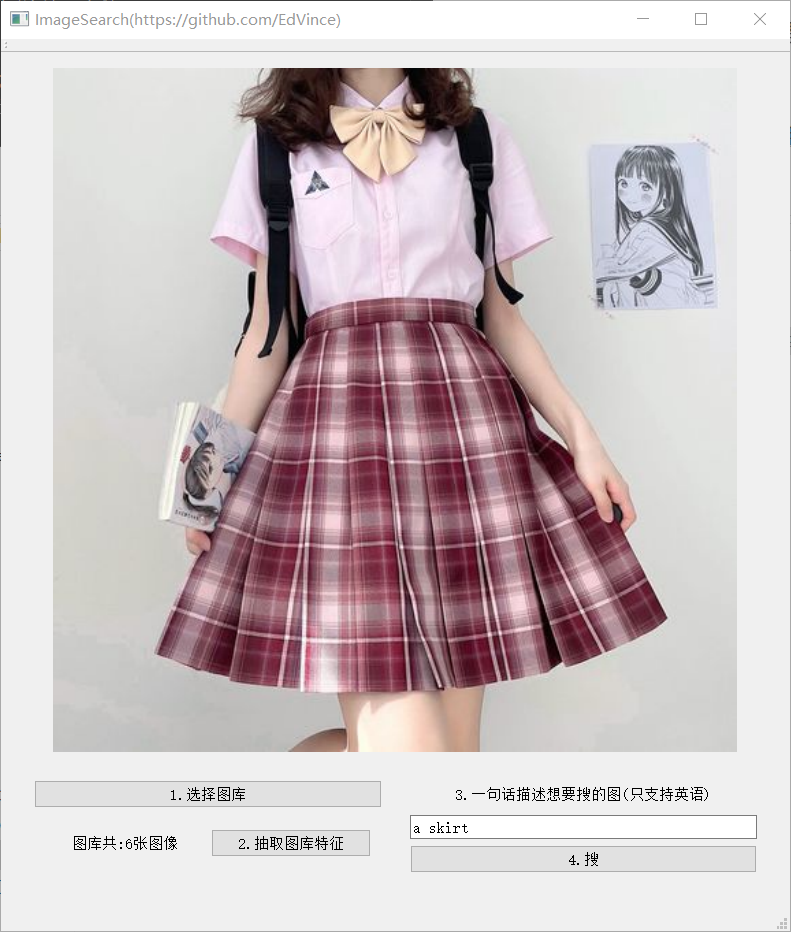

# CLIP-ImageSearch-NCNN

**为什么要做**：其实想做CLIP是因为我前面还想做GPT来的，当时想着既然要做GPT，为什么不把CLIP也做了呢？(不知廉耻的引一下流[GPT2-ChineseChat-NCNN](https://github.com/EdVince/GPT2-ChineseChat-NCNN))

**做什么模型**：CLIP跟GPT一样，玩法超级多，我是在awesome-CLIP里面选的，我一眼就看中[natural-language-image-search](https://github.com/haltakov/natural-language-image-search)这个项目了，给出一句话来描述想要的图片，就能从图库中搜出来符合要求的。当时看到这个项目，我就知道这是个天生就适合放在手机相册里面的功能，既然这样为何不搞呢？

**工作目标**：使用ncnn部署CLIP实现使用自然语言检索图像，目标是给出x86和android端的demo

**PS**：工作繁忙，更新缓慢，只求一个star

### Demo
x86: 可直接运行的[exe(提取码:6666)](https://pan.baidu.com/s/1vG2sw_ZkF2s6PFob9XVakQ)

用法：按照按钮的顺序点击就好了，举例：
1. 先点击“1.选择图库”，选择该repo的gallery文件夹
2. 然后点击“2.抽取图库特征”，抽取所选文件夹的所有图片的特征，耗时与图片数量有关
3. 在文本框内输入一句描述要想的图片的话，一定要用英文，大小写没关系
4. 最后点击“4.搜”，程序会自动返回图库中最匹配所输入文字的图片

### 工作原理
1. 使用CLIP的encode_image提取图片的特征，构建一个图库的特征向量
2. 使用CLIP的encode_text提取文字的特征，构建文本特征向量
3. 对两个特征向量求相似度，可以双向匹配，可以用文本匹配图片，也可以用图片匹配文本
4. 可以得到所有图片的相似度，我为了偷懒只显示了匹配概率最高的那一个
5. 稍微修改一下就可以做成手机相册自带搜图的那种返回一堆相关图片的功能了
6. 支持以图搜图、以字搜图、以图搜字、甚至是以字搜字。。。玩法很多，就是用那些特征求相似的问题，不赘述了
7. 最耗时间的其实是构建图库所有图片的特征向量，这里我用的是“RN50”这个模型，对图片使用resnet50进行特征抽取

### Repo结构
1. x86: 所提供的exe程序的源代码，基于qt
2. gallery: 一个小的图库，供测试用
3. resources: README的资源文件夹

### 工作内容
- [x] pytorch模型梳理与导出
- [x] x86 demo
    - 要编译的话，到[这里(提取码:6666)](https://pan.baidu.com/s/1ZoRrGYJcloSG-eb7h23gFA)下载.bin文件并放置到x86项目的assert文件夹下
- [ ] android demo

### 参考
1. [ncnn](https://github.com/Tencent/ncnn)
3. [CLIP](https://github.com/openai/CLIP)
2. [natural-language-image-search](https://github.com/haltakov/natural-language-image-search)